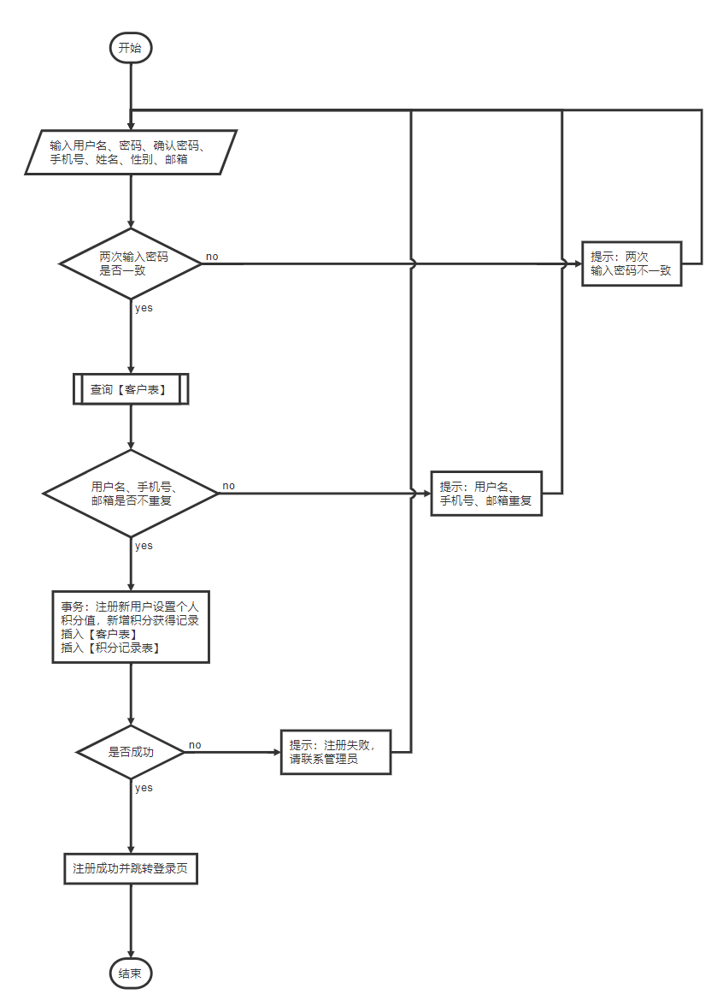
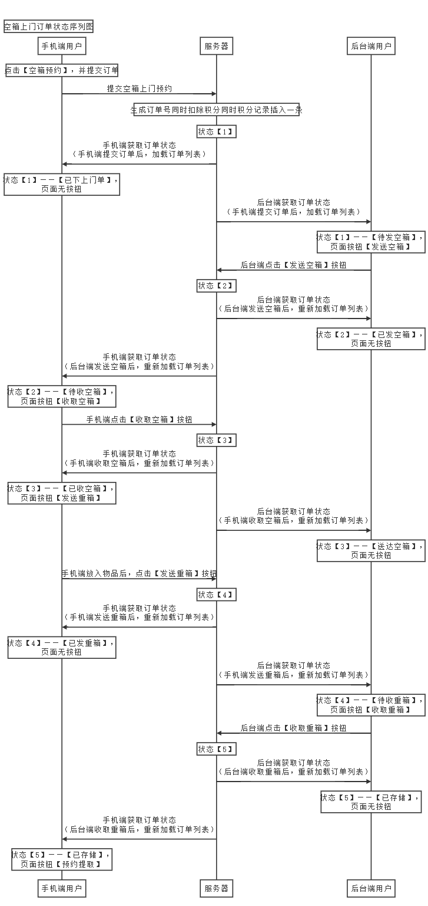
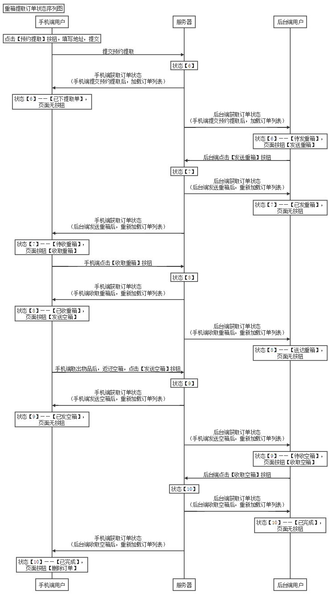

# 3. 功能设计

## 3.1 手机端

### 3.1.1 注册

#### 3.1.1.1 需求说明

* 手机端用户，在手机端登录页面，点击【注册】，跳转至手机端注册页面
* 注册成功后，跳转至登录页面

#### 3.1.1.2 页面元素

##### 3.1.1.2.1 注册

* 输入框
  * 用户名
  * 密码
  * 确认密码
  * 手机号
  * 姓名
  * 邮箱
* 单选
  * 性别
    * 男
    * 女
* 按钮
  * 注册

#### 3.1.1.3  详细设计

##### 3.1.1.3.1 注册

* 操作表
  * 客户表（手机端角色）
  * 积分记录表
* 校验

  * 用户名、手机号、邮箱不能重复
  * 两次输入的密码是否一致
  * 强密码（加分项）
  * 用户名：最大长度16，只能包含英文和数字
  * 密码：最大长度16，只能包含英文和数字
  * 手机号：最大长度11
  * 姓名：最大长度10
  * 性别：最大长度1
  * 邮箱：符合邮箱规则
* 注意事项
  * 事务：注册新用户设置个人积分值【客户表（手机端角色）】，同时新增积分获得记录【积分记录表】
* 图（可选）



```flow
start=>start: 开始
end=>end: 结束
input=>inputoutput: 输入用户名、密码、确认密码、
手机号、姓名、性别、邮箱
cond1=>condition: 两次输入密码
是否一致
op1=>operation: 提示：两次
输入密码不一致
sub1=>subroutine: 查询【客户表】
cond2=>condition: 用户名、手机号、
邮箱是否不重复
op2=>operation: 提示：用户名、
手机号、邮箱重复
op3=>operation: 事务：注册新用户设置个人
积分值，新增积分获得记录
插入【客户表】
插入【积分记录表】
cond3=>condition: 是否成功
op4=>operation: 注册成功并跳转登录页
op5=>operation: 提示：注册失败，
请联系管理员

start->input->cond1
cond1(yes)->sub1
cond1(no,right)->op1(right)->input
sub1->cond2
cond2(yes)->op3->cond3
cond2(no,right)->op2(right)->input
cond3(yes)->op4->end
cond3(no,right)->op5(right)->input
```

### 3.1.2 登录

#### 3.1.2.1 需求说明

* 手机端用户，打开App，直接进入登录页面，点击【登录】，成功后跳转至手机端首页
* 手机端用户，在手机端登录页面，点击【忘记密码？】，提示：请联系管理员+手机号
* 手机端用户，在手机端登录页面，点击【注册】，跳转至手机端注册页面

#### 3.1.2.2 页面元素

##### 3.1.2.2.1 登录

* 输入框
  * 用户名
  * 密码

* 按钮
  * 登录
  * 忘记密码？
  * 注册

#### 3.1.2.3  详细设计

##### 3.1.2.3.1 登录

* 操作表
  * 客户表（手机端角色）
* 校验（前端做校验）

  * 用户名：最大长度16，只能包含英文和数字
  * 密码：最大长度16，只能包含英文和数字
* 注意事项
  * 通过用户名可以登录（其他不可）
* 提示语：用户不存在/密码错误

### 3.1.3 首页

#### 3.1.3.1 需求说明

* 手机端用户，在手机端登录成功后，跳转至手机端首页
* 【广告】轮播
* 点击【广告】，跳转至广告详情页面
* 点击【空箱预约】，跳转至空箱预约页面
* 点击【我的订单】，跳转至订单列表页面
* 点击【个人中心】，跳转至个人中心页面

#### 3.1.3.2 页面元素

##### 3.1.3.2.1 首页

* 轮播图
  * 广告编号
  * 广告标题
  * 广告内容
  * 可获积分
  * 轮播图地址
  * 广告排序
  * 广告状态
    * 0：启用
    * 1：未启用
* 按钮
  * 空箱预约
  * 我的订单
  * 个人中心
  * 图片

##### 3.1.3.2.2 详情页面

* 显示项
  * 广告标题
  * 广告内容
  * 轮播图地址

#### 3.1.3.3  详细设计

##### 3.1.3.3.1 广告列表

* 操作表
  * 广告表
* 校验
  * 无
* 注意事项
  * 只获取广告状态为启用的数据
  * 轮播图按照广告排序字段，升序排列

##### 3.1.3.3.2 广告详情

* 操作表
  * 积分记录表
  * 客户表（手机端角色）
* 校验
  * 无
* 注意事项
  * 详情数据来自于列表，直接带过去
  * 点击列表图片，有广告积分获取的操作，事务：插入【积分记录表】，同时修改【客户表（手机端角色）】。如果抛异常，则在广告详情页面提示具体异常信息：积分获取失败，请联系管理员
  * 点击一次广告，就给一次积分

### 3.1.4 空箱预约

#### 3.1.4.1 需求说明

* 手机端用户，在手机端首页，点击【空箱预约】，进入空箱预约页面
* 查询当前用户默认收货地址，显示在收货信息处
* 点击收货信息出的按钮【>】，跳转至地址选择列表（地址管理功能的地址列表页面），点击地址列表，回显至空箱预约页面的收货信息
* 查询箱子信息（规格、积分、库存等）
* 点击【提交】，跳转至预约确认页面，点击【提交订单】，跳转至订单列表页面

#### 3.1.4.2 页面元素

##### 3.1.4.2.1 空箱预约

* 按钮
  * 提交
    * 点击跳转至预约确认页面
  * 收货信息部分的地址选择按钮“>”
    * 点击跳转至地址选择列表（地址管理功能的地址列表页面）
    * 点击地址列表，回显至空箱预约页面的收货信息
      * 姓名
      * 电话
      * 地址
      * 上门时间
      * 上门时段
      * 默认标识
  * 上门时间选择按钮“>”
  * 上门时段选择按钮“>”
* 单选
  * 箱子信息
    * 规格
    * 每月积分单价
* 加减控件
  * 租赁时长
* 输入项
  * 订单名称

##### 3.1.4.2.2 预约确认

* 显示项
  * 订单名称
  * 收货信息
    * 姓名
    * 电话
    * 地址
    * 上门时间
      * 上门时间
      * 上门时段
* 箱子信息
  
    * 规格
    * 每月积分单价
    * 租赁时长
    * 总计积分
* 实付积分
* 按钮
  * 提交订单

#### 3.1.4.3  详细设计

##### 3.1.4.3.1 空箱预约

* 操作表
  * 客户地址表
  * 箱子规格表
  * 箱子信息表
* 校验
  * 前后端校验租赁时长大于等于1个月
* 注意事项
  * 获取当前登录人的默认收货地址
  * 收货地址列表相关功能参考地址管理
  * 箱子信息，获取【箱子规格表】中，有效的箱子，且有库存的箱子（通过【箱子规格表】及【箱子信息表】计算得出）

##### 3.1.4.3.2 预约确认

* 操作表
  * 订单表
  * 箱子信息表
  * 积分记录表
  * 客户表（手机端角色）
* 校验
  * 当前客户积分，大于等于总计积分
* 注意事项
  * 新增订单时，冗余存储
    * 空箱上门姓名
    * 空箱上门电话
    * 空箱上门地址
    * 空箱上门时间
    * 空箱上门时段
    * 箱子id
    * 箱子编号
    * 箱子规格
    * 所需积分（每月积分单价）
  * 订单编号自动生成，调用工具类
  * 地址无省市区，只有一个完整的地址
  * 订单名称：本次订单内，箱子存放了什么等，方便后续根据此名称取回需要的箱子
  * 租赁时长计算（用创建时间，加租赁时长，得到到期时间；加分项：定时任务，到期自动送回机制，注意匹配相应手机端订单及后台订单状态）
  * 自动分配箱子，并标记箱子状态（已使用、及使用人）
    * 代码逻辑中，自动分配箱子，当前库存为0时，直接手动抛异常，回滚；如果当前的时间点，拿到当前箱子的version，update set version = version + 1 where version = 当前时间点的version（如果此时，另一个线程同时拿到了同一个箱子，那么，现在有A、B两个人，同时提交订单，同时拿到了箱子Box，此时version = 1，此时Box的version = 1；A先执行完成，update set version = version + 1 where version = 1，导致，Box的version = 2，此时，B在执行update set version = version + 1 where version = 1，导致更新了0条，进入补偿机制：重新自动分配箱子，直到所有箱子已被分配完。）
  * 完整事务：
    * 自动分配箱子
      * 订单
        * 箱子id ——（实时数据）
        * 箱子编号、箱子规格、所需积分（每月积分单价）——（冗余数据）
      * 箱子：已使用、及使用人
    * 新增订单
    * 新增积分使用记录
    * 设置客户当前积分
  * 异常信息
    * 提示：箱子库存不足，请重新选择
    * 提示：提交订单失败，请联系管理员

### 3.1.5 我的订单

#### 3.1.5.1 需求说明

* 手机端用户，在手机端首页，点击【我的订单】，进入订单列表页面
* 查询当前用户的订单列表（分页）
* 点击订单列表的订单，进入订单详情页面
* 订单详情页面，根据具体状态，可以执行相关操作

| 订单状态编码 | 手机端对应状态 | 手机端按钮 | 后台端对应状态 | 后台端按钮 |
| :----------: | :------------: | :--------: | :------------: | :--------: |
|      1       |   已下上门单   |     -      |    待发空箱    |  发送空箱  |
|      2       |    待收空箱    |  收取空箱  |    已发空箱    |     -      |
|      3       |    已收空箱    |  发送重箱  |    送达空箱    |     -      |
|      4       |    已发重箱    |     -      |    待收重箱    |  收取重箱  |
|      5       |     已存储     |  预约提取  |     已存储     |     -      |
|      6       |   已下提取单   |     -      |    待发重箱    |  发送重箱  |
|      7       |    待收重箱    |  收取重箱  |    已发重箱    |     -      |
|      8       |    已收重箱    |  发送空箱  |    送达重箱    |     -      |
|      9       |    已发空箱    |     -      |    待收空箱    |  收取空箱  |
|      10      |     已完成     |  删除订单  |     已完成     |     -      |

#### 3.1.5.2 页面元素

##### 3.1.5.2.1 订单列表

* 显示项
  * 订单信息列表
    * 点击跳转至订单详情页面
    * 订单编号
    * 订单状态（前后端约定一致写死）
    * 订单名称
    * 箱子id
    * 箱子编号（冗余数据）
    * 箱子规格（冗余数据）
    * 箱子积分单价（每月积分单价）（冗余数据）
    * 租赁时长
    * 实付积分
    * 订单状态（前后端约定一致写死）
    * 空箱上门下单时间（订单状态为1-5，显示）
    * 重箱提取下单时间（订单状态为6-10，显示）

##### 3.1.5.2.2 订单详情

* 显示项
  * 订单编号
  * 订单名称
  * 空箱上门下单时间（订单状态为1-5，显示）
  * 重箱提取下单时间（订单状态为6-10，显示）
  * 空箱上门姓名（订单状态为1-5，显示）
  * 空箱上门电话（订单状态为1-5，显示）
  * 空箱上门地址（订单状态为1-5，显示）
  * 空箱上门时间（订单状态为1-5，显示）
  * 空箱上门时段（订单状态为1-5，显示）
  * 重箱提取姓名（订单状态为6-10，显示）
  * 重箱提取电话（订单状态为6-10，显示）
  * 重箱提取地址（订单状态为6-10，显示）
  * 重箱提取时间（订单状态为6-10，显示）
  * 重箱提取时段（订单状态为6-10，显示）
  * 箱子id
  * 箱子编号（冗余数据）
  * 箱子规格（冗余数据）
  * 箱子积分单价（每月积分单价）（冗余数据）
  * 租赁时长
  * 实付积分
  * 订单状态
    * 1：已下上门单
    * 2：待收空箱
    * 3：已收空箱
    * 4：已发重箱
    * 5：已存储
    * 6：已下提取单
    * 7：待收重箱
    * 8：已收重箱
    * 9：已发空箱
    * 10：已完成
  * 配送人信息（删掉）

* 按钮
  * 收取空箱（对应状态2显示）
  * 发送重箱（对应状态3显示）
  * 预约提取（对应状态5显示）
  * 收取重箱（对应状态7显示）
  * 发送空箱（对应状态8显示）
  * 删除订单（对应状态10显示）

#### 3.1.5.3  详细设计

##### 3.1.5.3.1 订单列表

* 操作表
  * 订单表
* 校验
  * 无
* 注意事项
  * 需要根据当前订单状态，显示需要显示的下单时间
    * 空箱上门下单时间（订单状态为1-5，显示）
    * 重箱提取下单时间（订单状态为6-10，显示）
  * 箱子编号（冗余数据）
  * 箱子规格（冗余数据）
  * 所需积分（每月积分单价）（冗余数据）
* 图（可选）

##### 3.1.5.3.2 订单详情

* 操作表
  * 订单表
* 校验
  * 无
* 注意事项
  * 需要根据当前订单状态，显示需要显示的下单时间
    * 空箱上门下单时间（订单状态为1-5，显示）
    * 重箱提取下单时间（订单状态为6-10，显示）
  * 空箱上门姓名（订单状态为1-5，显示）
  * 空箱上门电话（订单状态为1-5，显示）
  * 空箱上门地址（订单状态为1-5，显示）
  * 空箱上门时间（订单状态为1-5，显示）
  * 空箱上门时段（订单状态为1-5，显示）
  * 重箱提取姓名（订单状态为6-10，显示）
  * 重箱提取电话（订单状态为6-10，显示）
  * 重箱提取地址（订单状态为6-10，显示）
  * 重箱提取时间（订单状态为6-10，显示）
  * 重箱提取时段（订单状态为6-10，显示）
  * 箱子编号（冗余数据）
  * 箱子规格（冗余数据）
  * 箱子积分单价（每月积分单价）（冗余数据）
  * 租赁时长
  * 实付积分
  * 订单状态（前后端约定一致写死）

##### 3.1.5.3.3 订单操作

| 订单状<br>态编码 |            操作            | 手机端<br>对应状态 | 手机端<br>按钮 |                             备注                             |
| :--------------: | :------------------------: | :----------------: | :------------: | :----------------------------------------------------------: |
|        1         | 手机端点击<br>【提交订单】 |     已下上门单     |       -        | 不操作订单历史表<br>写入空箱上门相关字段<br>重箱提取相关字段为空<br>写入空箱上门下单时间<br>操作订单状态<br>添加操作人 |
|        2         | 后台端点击<br>【发送空箱】 |      待收空箱      |    收取空箱    |                   手机端显示状态信息及按钮                   |
|        3         | 手机端点击<br>【收取空箱】 |      已收空箱      |    发送重箱    |          操作订单状态<br>修改操作人<br>修改更新时间          |
|        4         | 手机端点击<br>【发送重箱】 |      已发重箱      |       -        |          操作订单状态<br>修改操作人<br>修改更新时间          |
|        5         | 后台端点击<br>【收取重箱】 |       已存储       |    预约提取    |                   手机端显示状态信息及按钮                   |
|        6         | 手机端点击<br>【预约提取】 |     已下提取单     |       -        | 写入重箱提取相关字段<br>空箱上门相关字段不变<br>写入重箱提取下单时间 |
|        7         | 后台端点击<br>【发送重箱】 |      待收重箱      |    收取重箱    |                   手机端显示状态信息及按钮                   |
|        8         | 手机端点击<br>【收取重箱】 |      已收重箱      |    发送空箱    |          操作订单状态<br>修改操作人<br>修改更新时间          |
|        9         | 手机端点击<br>【发送空箱】 |      已发空箱      |       -        |          操作订单状态<br>修改操作人<br>修改更新时间          |
|        10        | 后台端点击<br>【收取空箱】 |       已完成       |    删除订单    |                   手机端显示状态信息及按钮                   |

* 操作表
  * 订单表
  * 订单历史表（只有空箱上门下单，不插入，其他状态修改，都插入）
  * 箱子信息表（只有后台端点击收取空箱，才修改箱子使用状态为未使用，请空使用人）
* 校验
  * 每个操作都要加乐观锁（提示：已有他人率先操作，请刷新后重试）
* 注意事项
  * 点击【预约提取】，需修改订单的重箱提取的地址信息、提取时间、提取时段、重箱提取下单时间
  * 删除订单，只修改手机端订单有效状态为已删除，而不修改后台端订单有效状态
  * 未完成的订单不可删除
  * 注意每个按钮的操作内包含的所有数据库操作，都在各自的事务里
  * 异常提示语：（按钮名称）失败
* 图






```sequence
Title:空箱上门订单状态序列图
participant 手机端用户 as A
participant 服务器 as S
participant 后台端用户 as B
Note over A: 点击【空箱预约】，并提交订单
A->S: 提交空箱上门预约
Note over S: 生成订单号同时扣除积分同时积分记录插入一条
Note over S: 状态【1】
S->A: 手机端获取订单状态\n（手机端提交订单后，加载订单列表）
Note over A: 状态【1】——【已下上门单】，\n页面无按钮
S->B: 后台端获取订单状态\n（手机端提交订单后，加载订单列表）
Note over B: 状态【1】——【待发空箱】，\n页面按钮【发送空箱】
B->S: 后台端点击【发送空箱】按钮
Note over S: 状态【2】
S->B: 后台端获取订单状态\n（后台端发送空箱后，重新加载订单列表）
Note over B: 状态【2】——【已发空箱】，\n页面无按钮
S->A: 手机端获取订单状态\n（后台端发送空箱后，重新加载订单列表）
Note over A: 状态【2】——【待收空箱】，\n页面按钮【收取空箱】
A->S: 手机端点击【收取空箱】按钮
Note over S: 状态【3】
S->A: 手机端获取订单状态\n（手机端收取空箱后，重新加载订单列表）
Note over A: 状态【3】——【已收空箱】，\n页面按钮【发送重箱】
S->B: 后台端获取订单状态\n（手机端收取空箱后，重新加载订单列表）
Note over B: 状态【3】——【送达空箱】，\n页面无按钮
A->S: 手机端放入物品后，点击【发送重箱】按钮
Note over S: 状态【4】
S->A: 手机端获取订单状态\n（手机端发送重箱后，重新加载订单列表）
Note over A: 状态【4】——【已发重箱】，\n页面无按钮
S->B: 后台端获取订单状态\n（手机端发送重箱后，重新加载订单列表）
Note over B: 状态【4】——【待收重箱】，\n页面按钮【收取重箱】
B->S: 后台端点击【收取重箱】按钮
Note over S: 状态【5】
S->B: 后台端获取订单状态\n（后台端收取重箱后，重新加载订单列表）
Note over B: 状态【5】——【已存储】，\n页面无按钮
S->A: 手机端获取订单状态\n（后台端收取重箱后，重新加载订单列表）
Note over A: 状态【5】——【已存储】，\n页面按钮【预约提取】
```

```sequence
Title:重箱提取订单状态序列图
participant 手机端用户 as A
participant 服务器 as S
participant 后台端用户 as B
Note over A: 点击【预约提取】按钮，填写地址，提交
A->S: 提交预约提取
Note over S: 状态【6】
S->A: 手机端获取订单状态\n（手机端提交预约提取后，加载订单列表）
Note over A: 状态【6】——【已下提取单】，\n页面无按钮
S->B: 后台端获取订单状态\n（手机端提交预约提取后，加载订单列表）
Note over B: 状态【6】——【待发重箱】，\n页面按钮【发送重箱】
B->S: 后台端点击【发送重箱】按钮
Note over S: 状态【7】
S->B: 后台端获取订单状态\n（后台端发送重箱后，重新加载订单列表）
Note over B: 状态【7】——【已发重箱】，\n页面无按钮
S->A: 手机端获取订单状态\n（后台端发送重箱后，重新加载订单列表）
Note over A: 状态【7】——【待收重箱】，\n页面按钮【收取重箱】
A->S: 手机端点击【收取重箱】按钮
Note over S: 状态【8】
S->A: 手机端获取订单状态\n（手机端收取重箱后，重新加载订单列表）
Note over A: 状态【8】——【已收重箱】，\n页面按钮【发送空箱】
S->B: 后台端获取订单状态\n（手机端收取重箱后，重新加载订单列表）
Note over B: 状态【8】——【送达重箱】，\n页面无按钮
A->S: 手机端取出物品后，返还空箱，点击【发送空箱】按钮
Note over S: 状态【9】
S->A: 手机端获取订单状态\n（手机端发送空箱后，重新加载订单列表）
Note over A: 状态【9】——【已发空箱】，\n页面无按钮
S->B: 后台端获取订单状态\n（手机端发送空箱后，重新加载订单列表）
Note over B: 状态【9】——【待收空箱】，\n页面按钮【收取空箱】
B->S: 后台端点击【收取空箱】按钮
Note over S: 状态【10】
S->B: 后台端获取订单状态\n（后台端收取空箱后，重新加载订单列表）
Note over B: 状态【10】——【已完成】，\n页面无按钮
S->A: 手机端获取订单状态\n（后台端收取空箱后，重新加载订单列表）
Note over A: 状态【10】——【已完成】，\n页面按钮【删除订单】
```

### 3.1.6 个人中心

#### 3.1.6.1 需求说明

* 手机端用户，在手机端首页点击【个人中心】按钮，跳转至个人中心页面
* 显示个人信息
* 点击【个人信息】，跳转至个人信息页面
* 点击【修改密码】，跳转至修改密码页面
* 点击【积分记录】，跳转至积分记录页面
* 点击【意见建议】，跳转至意见建议页面
* 点击【关于我们】，跳转至关于我们页面（前端静态页）

#### 3.1.6.2 页面元素

##### 3.1.6.2.1 个人中心

* 展示项
  * 头像地址
  * 客户姓名
* 按钮
  * 个人信息
  * 修改密码
  * 积分记录
  * 地址管理
  * 意见建议
  * 关于我们

##### 3.1.6.2.2 个人信息

* 输入项
  * 姓名
  * 手机号
  * 邮箱
* 单选项
  * 性别
* 按钮
  * 保存

##### 3.1.6.2.3 修改密码

* 输入项
  * 原密码
  * 新密码
  * 确认新密码
* 按钮
  * 保存

##### 3.1.6.2.4 积分记录

* 显示项
  * 当前积分
  * 积分明细列表
    * 方式
      * 1：注册赠送
      * 2：活动获得
      * 3：积分使用
    * 积分（积分获得为正数，积分使用未负数）
    * 积分记录时间

##### 3.1.6.2.5 地址管理

###### 3.1.6.2.5.1 列表

* 展示项
  * 地址列表
    * 姓名
    * 电话
    * 地址
    * 是否为默认地址
* 按钮
  * 设置默认地址按钮
  * 新增
  * 编辑
  * 删除

###### 3.1.6.2.5.2 新增

* 输入项
  * 收货人
  * 手机号
  * 详细地址
* 开关项
  * 设为默认地址
* 按钮
  * 保存

###### 3.1.6.2.5.3 编辑

* 输入项
  * 收货人
  * 手机号
  * 详细地址
* 开关项
  * 设为默认地址
* 按钮
  * 保存

##### 3.1.6.2.6 意见建议

* 输入项
  * 标题
  * 内容
* 按钮
  * 提交

##### 3.1.6.2.7 关于我们

* 展示项目
  * 前端自定内容

#### 3.1.6.3  详细设计

##### 3.1.6.3.1 个人中心

* 操作表

  * 客户表（手机端角色）

* 校验

  * 无

* 注意事项

  * 查询内容

    * 姓名
    * 手机号
    * 邮箱

    * 性别
    * 头像（建议裁剪，设置所有人头像都一样，不能改）


##### 3.1.6.3.2 个人信息

* 操作表

  * 无

* 校验

  * 无

* 注意事项

  * 内容从个人中心中带过来

    * 姓名
    * 手机号
    * 邮箱

    * 性别
    * 头像（建议裁剪，设置所有人头像都一样，不能改）


##### 3.1.6.3.3 修改密码

* 操作表
  * 客户表（手机端角色）
* 校验
  * 新密码和原密码不能一致（提示：新密码和原密码不能一致）
  * 新密码和确认新密码要一致（提示：两次输入新密码不一致）
  * 强密码（加分项）
  * 密码：最大长度16，只能包含英文和数字
* 注意事项
  * 原密码要查询【客户表（手机端角色）】以确认密码正确

##### 3.1.6.3.4 积分记录

* 操作表
  * 客户表（手机端角色）
  * 积分记录表
* 校验
  * 无
* 注意事项
  * 分页

##### 3.1.6.3.5 地址管理

###### 3.1.6.3.5.1 列表

* 操作表
  * 客户地址表
* 校验
  * 无
* 注意事项
  * 分页
  * 设置默认地址，要先update 客户地址表 set 默认地址=1 where 客户=当前用户 and 默认地址=0，然后再设置默认地址
  * 删除为逻辑删除，删除默认地址，则当前无默认地址（获取默认地址为空）

###### 3.1.6.3.5.2 新增

* 操作表
  * 客户地址表
* 校验
  * 收货人、手机号、地址，不能为空（提示：收货人/手机号/地址/不能为空）
* 注意事项
  * 设置默认地址，要先update 客户地址表 set 默认地址=1 where 客户=当前用户 and 默认地址=0，然后再新增客户地址

###### 3.1.6.3.5.3 编辑

* 操作表
  * 客户地址表
* 校验
  * 收货人、手机号、地址，不能为空（提示：收货人/手机号/地址/不能为空）
* 注意事项
  * 数据从列表带过来，不查库
  * 设置默认地址，要先update 客户地址表 set 默认地址=1 where 客户=当前用户 and 默认地址=0，然后再修改客户地址

##### 3.1.6.3.6 意见建议

* 操作表
  * 意见表
* 校验
  * 标题、内容不能为空（提示：标题/内容为空）
  * 标题最大长度20
  * 内容最大长度1000
* 注意事项
  * 注意控制标题长度，以及内容长度，不能超过我们设置的字段大小

##### 3.1.6.3.7 关于我们

* 操作表
  * 无
* 校验
  * 无
* 注意事项
  * 前端自定内容

## 3.2 后台端

### 3.2.1 登录

#### 3.2.1.1 需求说明

* 后台端用户，打开网址，直接进入登录页面，点击【登录】，成功后跳转至订单管理页面
* 后台端用户，在手机端登录页面，点击【忘记密码，寻求帮助？】，提示：请联系管理员+手机号

#### 3.2.1.2 页面元素

##### 3.2.1.2.1 登录

* 输入框
  * 用户名
  * 密码

* 按钮
  * 登录
  * 忘记密码，寻求帮助？

#### 3.2.1.3  详细设计

##### 3.2.1.3.1 登录

* 操作表
  * 用户表（后台端角色）
* 校验（前端做校验）

  * 用户名：最大长度16，只能包含英文和数字
  * 密码：最大长度16，只能包含英文和数字
* 注意事项
  * 通过用户名可以登录（其他不可）
* 提示语：用户不存在/密码错误


### 3.2.2 首页

#### 3.2.2.1 需求说明

* 后台端用户，在登录成功后，跳转至订单管理页面
* 右上角显示用户名
* 点击【修改密码】，弹窗修改密码页面
* 点击【退出登录】，清空登录信息，跳转至登录页

#### 3.2.2.2 页面元素

##### 3.2.2.2.1 首页

* 展示项
  * 用户名
  * 菜单
    * 用户管理（跳转页面）
    * 客户管理（跳转页面）
    * 箱子管理（跳转页面）
    * 订单管理（跳转页面）
    * 广告管理（跳转页面）
    * 意见建议（跳转页面）
* 按钮
  * 修改密码
  * 退出登录

#### 3.2.2.3 详细设计

##### 3.2.2.3.1 首页

* 操作表
  * 无
* 校验
  * 无
* 注意事项
  * 前端直接获取当前登录人接口，以得到用户名

##### 3.2.2.3.2 修改密码

* 操作表
  * 用户表（后台端角色）
* 校验
  * 新密码和原密码不能一致（提示：新密码和原密码不能一致）
  * 新密码和确认新密码要一致（提示：两次输入新密码不一致）
  * 强密码（加分项）
  * 密码：最大长度16，只能包含英文和数字
* 注意事项
  * 原密码要查询【用户表（后台端角色）】以确认密码正确

##### 3.2.2.3.3 退出登录

* 操作表
  * 无
* 校验
  * 无
* 注意事项
  * 清除登录信息

### 3.2.3 用户管理

#### 3.2.3.1 需求说明

* 点击【用户管理】菜单，进入用户管理列表页
* 点击【新增】按钮，进入用户新增页
* 点击【编辑】按钮，进入用户编辑页（数据直接从列表带出）
* 点击【启用】按钮，启用多个用户
* 点击【停用】按钮，停用多个用户
* 点击【删除】按钮，删除多个用户
* 点击【查询】按钮，根据查询条件，加载列表页
* 点击【重置】按钮，清空查询条件，加载列表页

#### 3.2.3.2 页面元素

##### 3.2.3.2.1 列表页

* 显示项
  * 用户名
  * 姓名
  * 手机号
  * 邮箱
  * 状态
* 输入项
  * 单个输入框（姓名、用户名、手机号、邮箱都可以进行查询）
* 按钮
  * 查询
  * 重置
  * 新增
  * 编辑
  * 启用
  * 停用
  * 删除
  * 重置密码
  * 全选

##### 3.2.3.2.2 新增页

* 输入项
  * 用户名
  * 姓名
  * 性别
  * 手机号
  * 邮箱
* 按钮
  * 保存
  * 取消

##### 3.2.3.2.3 编辑页

* 显示项
  * 用户名（不能改）
* 输入项
  * 姓名
  * 性别
  * 手机号
  * 邮箱
* 按钮
  * 保存
  * 取消

#### 3.2.3.3 详细设计

##### 3.2.3.3.1 列表页

###### 3.2.3.3.1.1 查询

* 操作表
  * 用户表（后台端角色）
* 校验

  * 用户名、姓名，不包含特殊字符（前端校验）
* 注意事项
  * 查询列表结果
    * 用户名
    * 姓名
    * 性别
    * 手机号
    * 邮箱
    * 状态

###### 3.2.3.3.1.2 启用

* 操作表
  * 用户表（后台端角色）
* 校验

  * 当前状态为启用的用户，不能启用（提示：状态为启用的用户，不能启用）
* 注意事项
  * 可操作多个用户
  * 注意并发操作，用version加乐观锁（update返回结果不等于传递List的大小，则抛异常）（提示：当前用户已被他人操作，请刷新后重试）

###### 3.2.3.3.1.3 停用

* 操作表
  * 用户表（后台端角色）
* 校验

  * 当前状态为停用的用户，不能停用（提示：状态为停用的用户，不能停用）
* 注意事项
  * 可操作多个用户
  * 注意并发操作，用version加乐观锁（update返回结果不等于传递List的大小，则抛异常）（提示：当前用户已被他人操作，请刷新后重试）

###### 3.2.3.3.1.4 删除

* 操作表
  * 用户表（后台端角色）
* 校验

  * 当前状态为停用的用户，才可以删除（提示：状态为停用的用户，才可以删除）
* 注意事项
  * 可操作多个用户
  * 注意并发操作，用version加乐观锁（update返回结果不等于传递List的大小，则抛异常）（提示：当前用户已被他人操作，请刷新后重试）
  * 逻辑删除（设置del_flag字段为已删除）

###### 3.2.3.3.1.5 重置密码

* 操作表
  * 用户表（后台端角色）
* 校验

  * 无
* 注意事项
  * 可操作多个用户
  * 注意并发操作，用version加乐观锁（update返回结果不等于传递List的大小，则抛异常）（提示：当前用户已被他人操作，请刷新后重试）
  * 重置为初始密码：【Abc123456】

##### 3.2.3.3.2 新增页

* 操作表
  * 用户表（后台端角色）
* 校验

  * 用户名：最大长度16，只能包含英文和数字
  * 手机号：最大长度11
  * 姓名：最大长度10
  * 性别：最大长度1
  * 邮箱：符合邮箱规则
  * 校验用户名、手机号、邮箱是否重复（提示：用户名/手机号/邮箱重复）
* 注意事项
  * 默认密码【Abc123456】

##### 3.2.3.3.3 编辑页

* 操作表
  * 用户表（后台端角色）
* 校验

  * 手机号：最大长度11
  * 姓名：最大长度10
  * 性别：最大长度1
  * 邮箱：符合邮箱规则
  * 校验手机号、邮箱是否重复（去除当前数据，其他数据有无重复）（提示：手机号/邮箱重复）
* 注意事项
  * 用户名不能修改
  * 数据从列表页带过来
  * 点击保存，加入乐观锁

### 3.2.4 客户管理

#### 3.2.4.1 需求说明

* 点击【客户管理】菜单，进入客户管理列表页
* 点击【新增】按钮，进入客户新增页
* 点击【编辑】按钮，进入客户编辑页（数据直接从列表带出）
* 点击【启用】按钮，启用多个客户
* 点击【停用】按钮，停用多个客户
* 点击【删除】按钮，删除多个客户
* 点击【查询】按钮，根据查询条件，加载列表页
* 点击【重置】按钮，清空查询条件，加载列表页

#### 3.2.4.2 页面元素

##### 3.2.4.2.1 列表页

* 显示项
  * 客户名
  * 姓名
  * 手机号
  * 邮箱
  * 积分
  * 状态
* 输入项
  * 单个输入框（姓名、客户名、手机号、邮箱都可以进行查询）
* 按钮
  * 查询
  * 重置
  * 新增
  * 编辑
  * 启用
  * 停用
  * 删除
  * 重置密码
  * 全选

##### 3.2.4.2.2 新增页

* 输入项
  * 客户名
  * 姓名
  * 手机号
  * 邮箱
* 按钮
  * 保存
  * 取消

##### 3.2.4.2.3 编辑页

* 显示项
  * 客户名（不能改）
* 输入项
  * 姓名
  * 手机号
  * 邮箱
* 按钮
  * 保存
  * 取消

#### 3.2.4.3 详细设计

##### 3.2.4.3.1 列表页

###### 3.2.4.3.1.1 查询

* 操作表
  * 客户表（手机端角色）
* 校验

  * 客户名、姓名，不包含特殊字符（前端校验）
* 注意事项
  * 查询列表结果
    * 客户名
    * 姓名
    * 性别
    * 手机号
    * 邮箱
    * 积分
    * 状态

###### 3.2.4.3.1.2 启用

* 操作表
  * 客户表（手机端角色）
* 校验

  * 当前状态为启用的客户，不能启用（提示：状态为启用的客户，不能启用）
* 注意事项
  * 可操作多个客户
  * 注意并发操作，用version加乐观锁（update返回结果不等于传递List的大小，则抛异常）（提示：当前客户已被他人操作，请刷新后重试）

###### 3.2.4.3.1.3 停用

* 操作表
  * 客户表（手机端角色）
* 校验

  * 当前状态为停用的客户，不能停用（提示：状态为停用的客户，不能停用）
* 注意事项
  * 可操作多个客户
  * 注意并发操作，用version加乐观锁（update返回结果不等于传递List的大小，则抛异常）（提示：当前客户已被他人操作，请刷新后重试）

###### 3.2.4.3.1.4 删除

* 操作表
  * 客户表（手机端角色）
* 校验

  * 当前状态为停用的客户，才可以删除（提示：状态为停用的客户，才可以删除）
* 注意事项
  * 可操作多个客户
  * 注意并发操作，用version加乐观锁（update返回结果不等于传递List的大小，则抛异常）（提示：当前客户已被他人操作，请刷新后重试）
  * 逻辑删除（设置del_flag字段为已删除）

###### 3.2.4.3.1.5 重置密码

* 操作表
  * 客户表（手机端角色）
* 校验

  * 无
* 注意事项
  * 可操作多个客户
  * 注意并发操作，用version加乐观锁（update返回结果不等于传递List的大小，则抛异常）（提示：当前客户已被他人操作，请刷新后重试）
  * 重置为初始密码：【12345678】

##### 3.2.4.3.2 新增页

* 操作表
  * 客户表（手机端角色）
* 校验

  * 客户名：最大长度16，只能包含英文和数字
  * 手机号：最大长度11
  * 姓名：最大长度10
  * 性别：最大长度1
  * 邮箱：符合邮箱规则
* 注意事项
  * 默认密码【12345678】
  * 校验客户名、手机号、邮箱是否重复（提示：客户名/手机号/邮箱重复）
  * 积分默认为0，因为不是从手机端注册的，不给积分（数据库加check，只能大于等于0）

##### 3.2.4.3.3 编辑页

* 操作表
  * 客户表（手机端角色）
* 校验

  * 手机号：最大长度11
  * 姓名：最大长度10
  * 性别：最大长度1
  * 邮箱：符合邮箱规则
  * 校验手机号、邮箱是否重复（去除当前数据，其他数据有无重复）（提示：手机号/邮箱重复）
* 注意事项
  * 客户名不能修改
  * 数据从列表页带过来
  * 点击保存，加入乐观锁

### 3.2.5 箱子管理

#### 3.2.5.1 需求说明

* 点击【箱子管理】菜单，展开二级菜单【箱子规格】和【箱子信息】
* 点击二级菜单【箱子规格】，进入箱子规格列表页面
* 点击二级菜单【箱子信息】，进入箱子信息列表页面
* 点击【箱子规格列表页面】的【新增】按钮，进入新增箱子规格页面
* 点击【箱子规格列表页面】的【删除】按钮，删除多个箱子规格
* 点击【箱子信息列表页面】的【新增】按钮，进入新增箱子信息页面
* 点击【箱子信息列表页面】的【删除】按钮，删除多个具体箱子
* 点击【查询】按钮，根据查询条件，加载列表页
* 点击【重置】按钮，清空查询条件，加载列表页

#### 3.2.5.2 页面元素

##### 3.2.5.2.1 箱子规格

###### 3.2.5.2.1.1 列表

* 显示项
  * 箱子规格
  * 总数量
  * 已使用数量
  * 库存
  * 使用比例
  * 所需积分（每月积分单价）
* 输入项
  * 箱子规格

* 按钮
  * 查询
  * 重置
  * 新增
  * 删除

###### 3.2.5.2.1.2 新增

* 输入项
  * 箱子规格
  * 数量
  * 所需积分
  * 备注
* 按钮
  * 保存
  * 取消

##### 3.2.5.2.2 箱子信息

###### 3.2.5.2.2.1 列表

* 显示项
  * 箱子规格
  * 箱子编号
  * 所需积分（每月积分单价）
  * 使用状态
    * 0：未使用
    * 1：已使用
  * 使用人
  * 备注
  * （删除标识）
    * 0：未删除
* 输入项
  * 箱子规格
  * 使用状态
  * 使用人

* 按钮
  * 查询
  * 重置
  * 新增
  * 删除

###### 3.2.5.2.2.2 新增

* 输入项
  * 箱子规格
  * （箱子编号——自动生成）
  * （所需积分——选择箱子规格后带出）
  * （使用人——空）
  * （使用状态——0：未使用）
  * 备注
* 按钮
  * 保存
  * 取消

#### 3.2.5.3  详细设计

##### 3.2.5.3.1 箱子规格

###### 3.2.5.3.1.1 列表

* 操作表
  * 箱子规格表
  * 箱子信息表
* 校验

  * 箱子规格，不包含特殊字符（前端校验）
* 注意事项
  * 查询列表结果
    * 箱子规格
    * 总数量
    * 已使用数量
    * 库存
    * 使用比例
    * 所需积分（每月积分单价）

###### 3.2.5.3.1.2 新增

* 操作表
  * 箱子规格表
  * 箱子信息表
* 校验

  * 箱子规格、数量、所需积分不能为空
  * 数量必须大于等于0
  * 对于已经存在的规格，判定所需积分（每月积分单价）是否与当前规格的所需积分一致，一致，则根据条数添加【箱子信息表】的数据
* 注意事项
  * 操作项
    * 箱子规格
    * 数量
    * 所需积分
    * 备注
  * 对于【箱子规格表】，插入1条，箱子规格、所需积分（每月积分单价）、备注
  * 对于【箱子信息表】，插入n条（n=数量），自动生成箱子编号，写入箱子规格、可以冗余存储所需积分（每月积分单价）、写入备注

###### 3.2.5.3.1.3 删除

* 操作表
  * 箱子规格表
  * 箱子信息表
* 校验

  * 当前规格下，仍然有箱子，则规格不能删除
* 注意事项
  * 逻辑删除

##### 3.2.5.3.2 箱子信息

###### 3.2.5.3.2.1 列表

* 操作表
  * 箱子规格表
  * 箱子信息表
  * 用户表
* 校验

  * 箱子规格为下拉列表（从箱子规格表中获取）
  * 使用状态为下拉列表（0：未使用；1：已使用）
  * 使用人为输入框，不能存在特殊字符
* 注意事项
  * 查询列表结果
    * 箱子编号
    * 箱子规格
    * 所需积分（每月积分单价）
    * 使用状态
      * 0：未使用
      * 1：已使用
    * 使用人
    * 备注
    * （删除标识）
      * 0：未删除

###### 3.2.5.3.2.2 新增

* 操作表
  * 箱子信息表
  * 箱子规格表
* 校验
  * 箱子规格为下拉列表（从箱子规格表中获取）

* 注意事项
  * 箱子规格（下拉列表，从箱子规格中获取）
  * （箱子编号——自动生成）
  * 所需积分（每月积分单价）
  * （使用人——空）
  * （使用状态——0：未使用）
  * （删除标识——0：未删除）
  * 备注

###### 3.2.5.3.2.3 删除

* 操作表
  * 订单表
  * 箱子信息表
* 校验

  * 当前箱子，仍有订单（未完成的订单）关联（箱子id），则箱子不能删除
* 注意事项
  * 逻辑删除

### 3.2.6 订单管理

#### 3.2.6.1 需求说明

* 后台端用户，点击【订单管理】，进入订单列表页面
* 查询订单列表（分页）
* 点击订单列表的订单，进入订单详情页面
* 订单列表操作列，可根据具体状态，可以执行相关操作
* 订单详情页面，根据具体状态，可以执行相关操作

| 订单状态编码 | 手机端对应状态 | 手机端按钮 | 后台端对应状态 | 后台端按钮 |
| :----------: | :------------: | :--------: | :------------: | :--------: |
|      1       |   已下上门单   |     -      |    待发空箱    |  发送空箱  |
|      2       |    待收空箱    |  收取空箱  |    已发空箱    |     -      |
|      3       |    已收空箱    |  发送重箱  |    送达空箱    |     -      |
|      4       |    已发重箱    |     -      |    待收重箱    |  收取重箱  |
|      5       |     已存储     |  预约提取  |     已存储     |     -      |
|      6       |   已下提取单   |     -      |    待发重箱    |  发送重箱  |
|      7       |    待收重箱    |  收取重箱  |    已发重箱    |     -      |
|      8       |    已收重箱    |  发送空箱  |    送达重箱    |     -      |
|      9       |    已发空箱    |     -      |    待收空箱    |  收取空箱  |
|      10      |     已完成     |  删除订单  |     已完成     |     -      |

#### 3.2.6.2 页面元素

##### 3.2.6.2.1 订单列表

* 显示项
  * 订单信息列表
    * 点击订单名称跳转至订单详情页面
    * 订单编号
    * 订单状态（前后端约定一致写死）
    * 订单名称
    * 客户名称
    * 箱子id
    * 箱子编号（冗余数据）
    * 箱子规格（冗余数据）
    * 所需积分（每月积分单价）（冗余数据）
    * 租赁时长
    * 实付积分
    * 空箱上门下单时间（订单状态为1-5，显示）
    * 重箱提取下单时间（订单状态为6-10，显示）
* 输入项
  * 客户名称
  * 订单状态（下拉框）
    * 1：待发空箱
    * 2：已发空箱
    * 3：送达空箱
    * 4：待收重箱
    * 5：已存储
    * 6：待发重箱
    * 7：已发重箱
    * 8：送达重箱
    * 9：待收空箱
    * 10：已完成
  * 下单时间
    * 开始时间
    * 结束时间
* 按钮
  * 订单名称
  * 删除按钮
  * 操作按钮
    * 发送空箱（对应状态1显示）
    * 收取重箱（对应状态4显示）
    * 发送重箱（对应状态6显示）
    * 收取空箱（对应状态9显示）

##### 3.2.6.2.2 订单详情

* 显示项
  * 订单编号
  * 订单名称
  * 空箱上门下单时间（订单状态为1-5，显示）
  * 重箱提取下单时间（订单状态为6-10，显示）
  * 空箱上门姓名（订单状态为1-5，显示）
  * 空箱上门电话（订单状态为1-5，显示）
  * 空箱上门地址（订单状态为1-5，显示）
  * 空箱上门时间（订单状态为1-5，显示）
  * 空箱上门时段（订单状态为1-5，显示）
  * 重箱提取姓名（订单状态为6-10，显示）
  * 重箱提取电话（订单状态为6-10，显示）
  * 重箱提取地址（订单状态为6-10，显示）
  * 重箱提取时间（订单状态为6-10，显示）
  * 重箱提取时段（订单状态为6-10，显示）
  * 箱子id
  * 箱子编号（冗余数据）
  * 箱子规格（冗余数据）
  * 箱子积分单价（每月积分单价）（冗余数据）
  * 租赁时长
  * 实付积分
  * 订单状态（前后端约定一致写死）
  * 配送人信息（删掉）

* 按钮
  * 发送空箱（对应状态1显示）
  * 收取重箱（对应状态4显示）
  * 发送重箱（对应状态6显示）
  * 收取空箱（对应状态9显示）

#### 3.2.6.3  详细设计

##### 3.2.6.3.1 订单列表

* 操作表
  * 订单表
  * 客户表（手机端角色）
* 校验
  * 无
* 注意事项
  * 需要根据当前订单状态，显示需要显示的下单时间
    * 空箱上门下单时间（订单状态为1-5，显示）
    * 重箱提取下单时间（订单状态为6-10，显示）
  * 客户名称（比手机端多一个客户名称的显示）
  * 箱子编号（冗余数据）
  * 箱子规格（冗余数据）
  * 箱子积分单价（每月积分单价）（冗余数据）

##### 3.2.6.3.2 订单详情

* 操作表
  * 订单表
  * 客户表（手机端角色）
* 校验
  * 无
* 注意事项
  * 需要根据当前订单状态，显示需要显示的下单时间
    * 空箱上门下单时间（订单状态为1-5，显示）
    * 重箱提取下单时间（订单状态为6-10，显示）
  * 空箱上门姓名（订单状态为1-5，显示）
  * 空箱上门电话（订单状态为1-5，显示）
  * 空箱上门地址（订单状态为1-5，显示）
  * 空箱上门时间（订单状态为1-5，显示）
  * 空箱上门时段（订单状态为1-5，显示）
  * 重箱提取姓名（订单状态为6-10，显示）
  * 重箱提取电话（订单状态为6-10，显示）
  * 重箱提取地址（订单状态为6-10，显示）
  * 重箱提取时间（订单状态为6-10，显示）
  * 重箱提取时段（订单状态为6-10，显示）
  * 客户名称（比手机端多一个客户名称的显示）
  * 箱子编号（冗余数据）
  * 箱子规格（冗余数据）
  * 箱子积分单价（每月积分单价）（冗余数据）
  * 租赁时长
  * 实付积分
  * 订单状态（前后端约定一致写死）

##### 3.2.6.3.3 订单操作

| 订单状<br>态编码 |            操作            | 后台端<br>对应状态 | 后台端<br>按钮 |                             备注                             |
| :--------------: | :------------------------: | :----------------: | :------------: | :----------------------------------------------------------: |
|        1         | 手机端点击<br>【提交订单】 |      待发空箱      |    发送空箱    |                   后台端显示状态信息及按钮                   |
|        2         | 后台端点击<br>【发送空箱】 |      已发空箱      |       -        |          操作订单状态<br>修改操作人<br>修改更新时间          |
|        3         | 手机端点击<br>【收取空箱】 |      送达空箱      |       -        |                      后台端显示状态信息                      |
|        4         | 手机端点击<br>【发送重箱】 |      待收重箱      |    收取重箱    |                   后台端显示状态信息及按钮                   |
|        5         | 后台端点击<br>【收取重箱】 |       已存储       |       -        |          操作订单状态<br>修改操作人<br>修改更新时间          |
|        6         | 手机端点击<br>【预约提取】 |      待发重箱      |    发送重箱    |                   后台端显示状态信息及按钮                   |
|        7         | 后台端点击<br>【发送重箱】 |      已发重箱      |       -        |          操作订单状态<br>修改操作人<br>修改更新时间          |
|        8         | 手机端点击<br>【收取重箱】 |      送达重箱      |       -        |                      后台端显示状态信息                      |
|        9         | 手机端点击<br>【发送空箱】 |      待收空箱      |    收取空箱    |                   后台端显示状态信息及按钮                   |
|        10        | 后台端点击<br>【收取空箱】 |       已完成       |       -        | 操作订单状态<br>修改操作人<br>修改更新时间<br>修改箱子信息表<br>（未使用、清空使用人） |

* 操作表
  * 订单表
  * 订单历史表（所有操作，都插入）
  * 箱子信息表（只有后台端点击收取空箱，才修改箱子使用状态为未使用，清空使用人）
* 校验
  * 每个操作都要加乐观锁（提示：已有他人率先操作，请刷新后重试）
* 注意事项
  * 点击【预约提取】，需修改订单的重箱提取的地址信息、提取时间、提取时段、重箱提取下单时间
  * 删除订单，只修改后台端订单有效状态为已删除，而不修改手机端订单有效状态
  * 未完成的订单不可删除（提示：未完成的订单不可删除）
  * 注意每个按钮的操作内包含的所有数据库操作，都在各自的事务里
  * 异常提示语：（按钮名称）失败

* 图

```sequence
Title:空箱上门订单状态序列图
participant 手机端用户 as A
participant 服务器 as S
participant 后台端用户 as B
Note over A: 点击【空箱预约】，并提交订单
A->S: 提交空箱上门预约
Note over S: 生成订单号同时扣除积分同时积分记录插入一条
Note over S: 状态【1】
S->A: 手机端获取订单状态\n（手机端提交订单后，加载订单列表）
Note over A: 状态【1】——【已下上门单】，\n页面无按钮
S->B: 后台端获取订单状态\n（手机端提交订单后，加载订单列表）
Note over B: 状态【1】——【待发空箱】，\n页面按钮【发送空箱】
B->S: 后台端点击【发送空箱】按钮
Note over S: 状态【2】
S->B: 后台端获取订单状态\n（后台端发送空箱后，重新加载订单列表）
Note over B: 状态【2】——【已发空箱】，\n页面无按钮
S->A: 手机端获取订单状态\n（后台端发送空箱后，重新加载订单列表）
Note over A: 状态【2】——【待收空箱】，\n页面按钮【收取空箱】
A->S: 手机端点击【收取空箱】按钮
Note over S: 状态【3】
S->A: 手机端获取订单状态\n（手机端收取空箱后，重新加载订单列表）
Note over A: 状态【3】——【已收空箱】，\n页面按钮【发送重箱】
S->B: 后台端获取订单状态\n（手机端收取空箱后，重新加载订单列表）
Note over B: 状态【3】——【送达空箱】，\n页面无按钮
A->S: 手机端放入物品后，点击【发送重箱】按钮
Note over S: 状态【4】
S->A: 手机端获取订单状态\n（手机端发送重箱后，重新加载订单列表）
Note over A: 状态【4】——【已发重箱】，\n页面无按钮
S->B: 后台端获取订单状态\n（手机端发送重箱后，重新加载订单列表）
Note over B: 状态【4】——【待收重箱】，\n页面按钮【收取重箱】
B->S: 后台端点击【收取重箱】按钮
Note over S: 状态【5】
S->B: 后台端获取订单状态\n（后台端收取重箱后，重新加载订单列表）
Note over B: 状态【5】——【已存储】，\n页面无按钮
S->A: 手机端获取订单状态\n（后台端收取重箱后，重新加载订单列表）
Note over A: 状态【5】——【已存储】，\n页面按钮【预约提取】
```


```sequence
Title:重箱提取订单状态序列图
participant 手机端用户 as A
participant 服务器 as S
participant 后台端用户 as B
Note over A: 点击【预约提取】按钮，填写地址，提交
A->S: 提交预约提取
Note over S: 状态【6】
S->A: 手机端获取订单状态\n（手机端提交预约提取后，加载订单列表）
Note over A: 状态【6】——【已下提取单】，\n页面无按钮
S->B: 后台端获取订单状态\n（手机端提交预约提取后，加载订单列表）
Note over B: 状态【6】——【待发重箱】，\n页面按钮【发送重箱】
B->S: 后台端点击【发送重箱】按钮
Note over S: 状态【7】
S->B: 后台端获取订单状态\n（后台端发送重箱后，重新加载订单列表）
Note over B: 状态【7】——【已发重箱】，\n页面无按钮
S->A: 手机端获取订单状态\n（后台端发送重箱后，重新加载订单列表）
Note over A: 状态【7】——【待收重箱】，\n页面按钮【收取重箱】
A->S: 手机端点击【收取重箱】按钮
Note over S: 状态【8】
S->A: 手机端获取订单状态\n（手机端收取重箱后，重新加载订单列表）
Note over A: 状态【8】——【已收重箱】，\n页面按钮【发送空箱】
S->B: 后台端获取订单状态\n（手机端收取重箱后，重新加载订单列表）
Note over B: 状态【8】——【送达重箱】，\n页面无按钮
A->S: 手机端取出物品后，返还空箱，点击【发送空箱】按钮
Note over S: 状态【9】
S->A: 手机端获取订单状态\n（手机端发送空箱后，重新加载订单列表）
Note over A: 状态【9】——【已发空箱】，\n页面无按钮
S->B: 后台端获取订单状态\n（手机端发送空箱后，重新加载订单列表）
Note over B: 状态【9】——【待收空箱】，\n页面按钮【收取空箱】
B->S: 后台端点击【收取空箱】按钮
Note over S: 状态【10】
S->B: 后台端获取订单状态\n（后台端收取空箱后，重新加载订单列表）
Note over B: 状态【10】——【已完成】，\n页面无按钮
S->A: 手机端获取订单状态\n（后台端收取空箱后，重新加载订单列表）
Note over A: 状态【10】——【已完成】，\n页面按钮【删除订单】
```

##### 3.2.6.3.3 订单删除

* 操作表
  * 订单表
  * 订单历史表
* 校验

  * 未完成的订单不可删除（提示：未完成的订单不可删除）
* 注意事项
  * 逻辑删除
  * 同时进入历史表

### 3.2.7 广告管理

#### 3.2.7.1 需求说明

* 点击【广告管理】菜单，进入广告管理列表页
* 点击【新增】按钮，进入广告新增页
* 点击【编辑】按钮，进入广告编辑页（数据直接从列表带出）
* 点击【启用】按钮，启用多个广告
* 点击【停用】按钮，停用多个广告
* 点击【删除】按钮，删除多个广告
* 点击【查询】按钮，根据查询条件，加载列表页
* 点击【重置】按钮，清空查询条件，加载列表页

#### 3.2.7.2 页面元素

##### 3.2.7.2.1 列表页面

* 显示项
  * 列表
    * 广告编号（广告id）
    * 广告标题
    * （广告内容）
    * 奖励积分
    * 图片地址
    * 广告排序
    * 广告状态
      * 0：启用
      * 1：未启用
    * 删除状态
      * 0：未删除
* 输入项
  * 单个输入框（广告标题、奖励积分、图片地址）
* 按钮
  * 查询
  * 重置
  * 新增
  * 编辑
  * 启用
  * 停用
  * 删除
  * 全选

##### 3.2.7.2.2 新增页

* 输入项
  * 广告标题
  * 广告内容
  * 奖励积分
  * 图片地址
  * 广告排序
* 上传项
  * 图片
* 按钮
  * 保存
  * 取消

##### 3.2.7.2.3 编辑页

* 输入项
  * 广告标题
  * 广告内容
  * 奖励积分
  * 图片地址
  * 广告排序
* 上传项
  * 图片
* 按钮
  * 保存
  * 取消

#### 3.2.7.3 详细设计

##### 3.2.7.3.1 列表页

###### 3.2.7.3.1.1 查询

* 操作表
  * 广告表
* 校验

  * 单个输入框不包含特殊字符（前端校验）
* 注意事项
  * 查询列表结果
    * 广告编号（广告id）
    * 广告标题
    * （广告内容）
    * 奖励积分
    * 图片地址
    * 广告排序
    * 广告状态
      * 0：启用
      * 1：未启用
    * 删除状态
      * 0：未删除
  * 按照广告排序升序进行查询

###### 3.2.7.3.1.2 启用

* 操作表
  * 广告表
* 校验

  * 当前状态为启用的广告，不能启用（提示：状态为启用的广告，不能启用）
* 注意事项
  * 可操作多个广告
  * 注意并发操作，用version加乐观锁（update返回结果不等于传递List的大小，则抛异常）（提示：当前广告已被他人操作，请刷新后重试）

###### 3.2.7.3.1.3 停用

* 操作表
  * 广告表
* 校验

  * 当前状态为停用的广告，不能停用（提示：状态为停用的广告，不能停用）
* 注意事项
  * 可操作多个广告
  * 注意并发操作，用version加乐观锁（update返回结果不等于传递List的大小，则抛异常）（提示：当前广告已被他人操作，请刷新后重试）

###### 3.2.7.3.1.4 删除

* 操作表
  * 广告表
* 校验

  * 当前状态为停用的广告，才可以删除（提示：状态为停用的广告，才可以删除）
* 注意事项
  * 可操作多个广告
  * 注意并发操作，用version加乐观锁（update返回结果不等于传递List的大小，则抛异常）（提示：当前广告已被他人操作，请刷新后重试）
  * 逻辑删除（设置del_flag字段为已删除）

##### 3.2.7.3.2 新增页

* 操作表
  * 广告表
* 校验

  * 广告标题（最大长度20）
  * 广告内容（最大长度1000）
  * 奖励积分（正整数）
  * 图片地址（最大长度512）
  * 广告排序（正整数）
* 注意事项
  * 广告列表允许重复

##### 3.2.7.3.3 编辑页

* 操作表
  * 广告表
* 校验

  * 广告标题（最大长度20）
  * 广告内容（最大长度1000）
  * 奖励积分（正整数）
  * 图片地址（最大长度512）
  * 广告排序（正整数）
* 注意事项
  * 广告列表允许重复

### 3.2.8 意见建议

#### 3.2.8.1 需求说明

* 点击【意见建议】菜单，进入意见建议列表页
* 点击【查询】按钮，根据查询条件，加载列表页
* 点击【重置】按钮，清空查询条件，加载列表页

#### 3.2.8.2 页面元素

##### 3.2.8.2.1 列表页面

* 显示项
  * 列表
    * 编号（意见建议id）
    * 提交人（显示姓名，实际存储提交人的用户名）
    * 意见标题
    * 意见内容
    * 提交时间
    * 删除状态
      * 0：未删除
* 输入项
  * 单个输入框（提交人、意见标题）
* 按钮
  * 查询
  * 重置

#### 3.2.8.3 详细设计

##### 3.2.8.3.1 列表页

* 操作表
  * 意见表
  * 客户表（手机端角色）
* 校验

  * 单个输入框不包含特殊字符（前端校验）
* 注意事项
  * 查询列表结果
    * 编号（意见建议id）
    * 提交人（显示姓名，实际存储提交人的用户id）
    * 意见标题
    * 意见内容
    * 提交时间（创建时间）
    * 删除状态
      * 0：未删除
  * 意见内容，查出显示区域，显示【...】，鼠标移入，提示全部信息（前端做）
